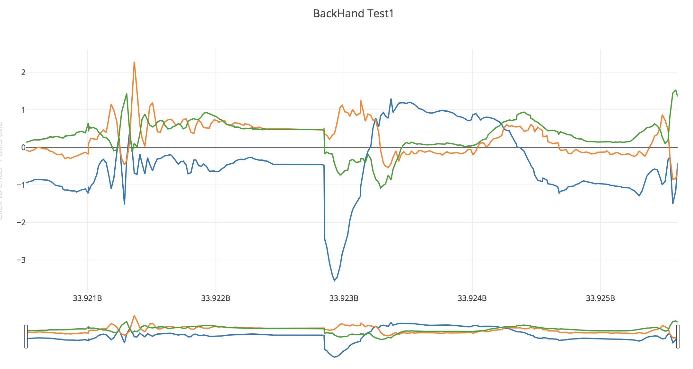
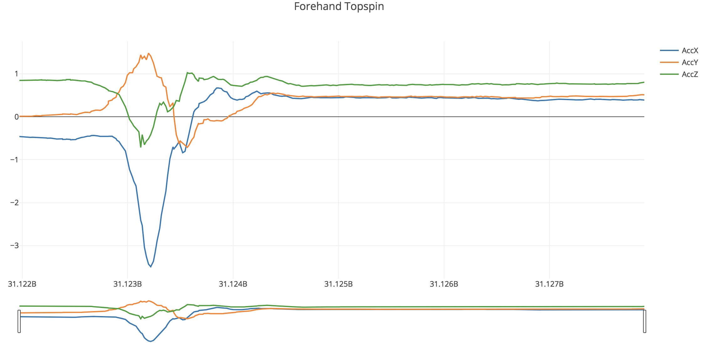
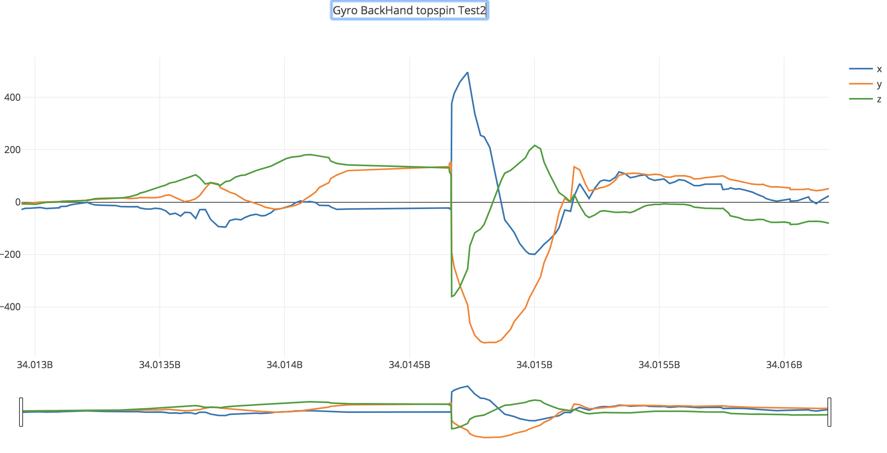
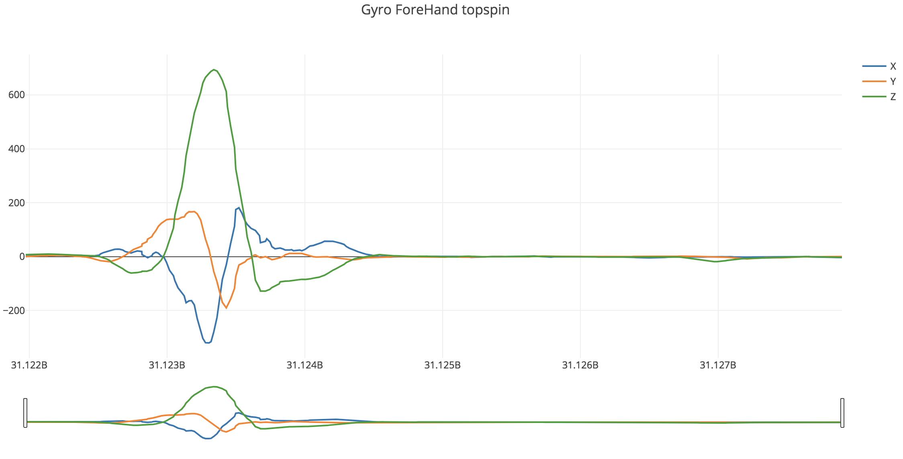

# Project Idea

This project is using Deep Learning and AI to improve a players game for racket sports, by providing constructive feedback and will notify the mistakes of players by comparing swings with other players. For now we will be developing deep learning models on Tennis sports, as it very dynamic game and consists of a good amount of difficulty compared to various racket sports including the number of strokes and swings possible in the game.

## [MYO Device](https://www.myo.com/)

[MYO](https://www.myo.com/) is a wearable technology. It is to be worn on the forearm. It consists of nine axis IMU (accelerometer for direction, a gyroscope for rotation) sensor, and it also has an EMG(electro Myogragpy) sensor which captures the muscle information of your forearm, generated through hand movements.

As this is completely new data, I wasn't able to manage to get data from the internet. I had to generate data on my own. So for this, I created a simple data collection tools which is used to gather the data using the api developed by [Nicola Corti](https://github.com/cortinico/) [github](https://github.com/cortinico/myonnaise), while I play tennis wearing this device on my hand. Now I went to one of the open tennis courts nearby to get the swing data.

I tried to figure what kind of data am I getting, do I see any correlation between data. 
Following is the image of the data that I am getting from accelerometer and gyroscope

